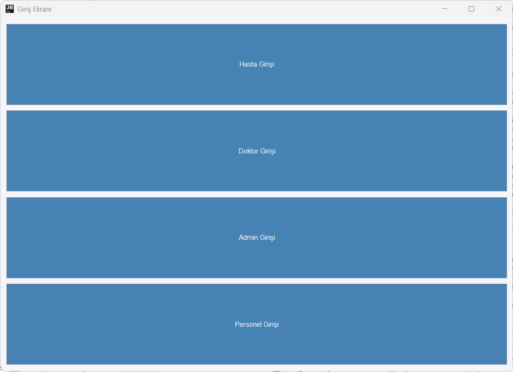
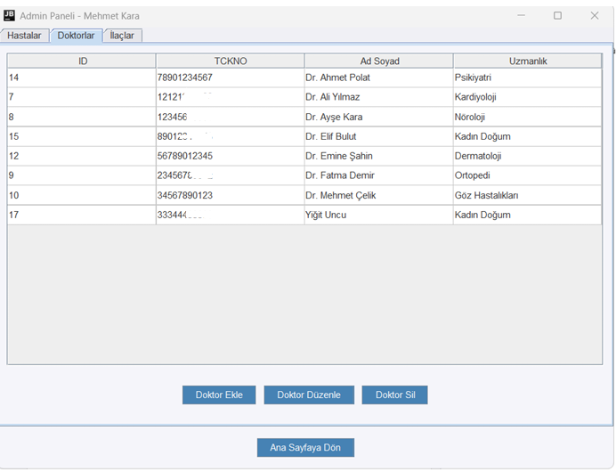
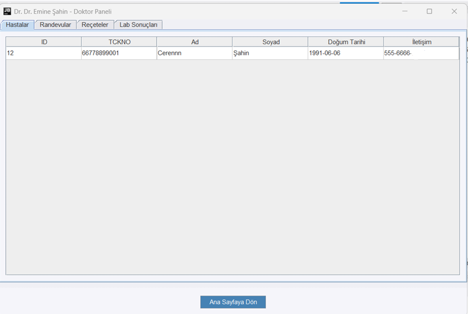
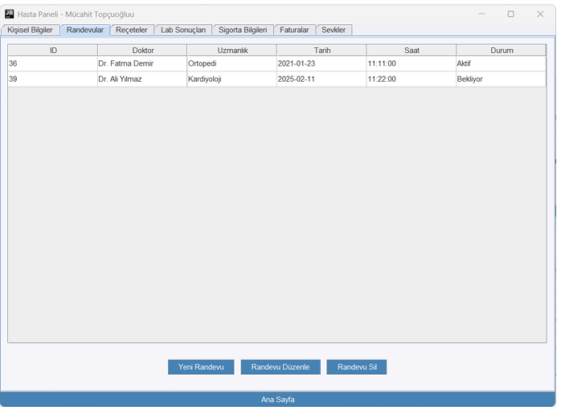
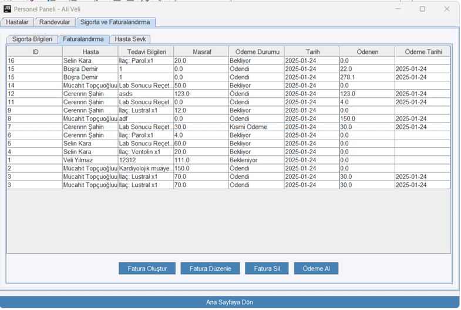
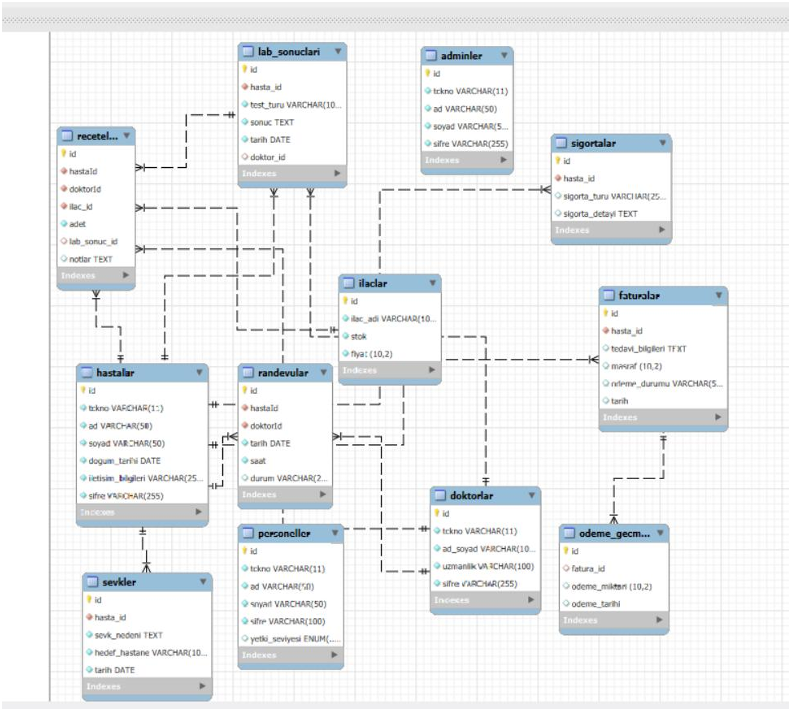

# Hastane Otomasyon Sistemi

Bu proje, hastanelerin günlük operasyonlarını yönetmek için tasarlanmış kapsamlı bir otomasyon sistemidir. Java Swing kullanılarak geliştirilmiş masaüstü uygulamasıdır.

## Özellikler

- **Çoklu Kullanıcı Rolü**
  - Admin
  - Doktor
  - Hasta
  - Personel

- **Hasta Yönetimi**
  - Hasta kayıt
  - Randevu sistemi
  - Hasta geçmişi takibi
  - Reçete yönetimi

- **Doktor Yönetimi**
  - Doktor kayıt
  - Randevu takvimi
  - Hasta kayıtlarına erişim
  - Reçete yazma

- **Laboratuvar**
  - Test sonuçları yönetimi
  - Sonuç raporlama
  - Geçmiş sonuçlara erişim

- **Fatura ve Sigorta**
  - Fatura oluşturma
  - Ödeme takibi
  - Sigorta işlemleri
  - Ödeme geçmişi

- **Sevk İşlemleri**
  - Hasta sevk
  - Sevk takibi
  - Sevk raporlama

## Teknolojiler

- Java
- Swing (GUI)
- MySQL
- JDBC

## Ekran Görüntüleri

### Giriş Ekranı


### Admin Paneli


### Doktor Paneli


### Hasta Paneli


### Personel Paneli



## Veritabanı Şeması

### ER Diyagramı


Sistem aşağıdaki temel tablolardan oluşmaktadır:

- **hastalar**
  - Hasta kişisel bilgileri
  - İletişim detayları
  - Sağlık geçmişi

- **doktorlar**
  - Doktor kişisel bilgileri
  - Uzmanlık alanı
  - Çalışma takvimi

- **adminler**
  - Sistem yönetici bilgileri
  - Yetki seviyeleri

- **personeller**
  - Personel bilgileri
  - Departman bilgileri

- **randevular**
  - Randevu tarihi ve saati
  - Hasta-Doktor ilişkisi
  - Randevu durumu

- **receteler**
  - İlaç bilgileri
  - Dozaj detayları
  - Reçete tarihi

- **lab_sonuclari**
  - Test türü
  - Sonuç değerleri
  - Rapor tarihi

- **faturalar**
  - Ödeme tutarı
  - Ödeme durumu
  - Fatura tarihi

- **sigortalar**
  - Sigorta türü
  - Kapsam detayları
  - Geçerlilik süresi

- **sevkler**
  - Sevk nedeni
  - Hedef hastane
  - Sevk tarihi

- **odeme_gecmisi**
  - Ödeme detayları
  - İşlem tarihi
  - Ödeme yöntemi

## Kurulum

1. Projeyi klonlayın:
```bash
git clone https://github.com/mucahit-topcuoglu/hastaneotomasyonu.git
```

2. MySQL veritabanını kurun ve `hastane.sql` dosyasını import edin.

3. `src/VeriTabaniBaglantisi.java` dosyasında veritabanı bağlantı bilgilerini güncelleyin:
```java
String url = "jdbc:mysql://localhost:3306/hastane";
String kullaniciAdi = "root";
String sifre = "1234";
```

4. Projeyi derleyin ve çalıştırın:
```bash
javac Main.java
java Main
```

## Kullanım

1. Uygulamayı başlatın
2. Rolünüze göre giriş yapın (Admin/Doktor/Hasta/Personel)
3. İlgili modülleri kullanarak işlemlerinizi gerçekleştirin

## Güvenlik

- Şifreler veritabanında saklanır
- Her kullanıcı rolü için özel yetkiler tanımlanmıştır
- Oturum yönetimi mevcuttur

## Katkıda Bulunma

1. Bu depoyu fork edin
2. Yeni bir branch oluşturun (`git checkout -b feature/yeniOzellik`)
3. Değişikliklerinizi commit edin (`git commit -am 'Yeni özellik eklendi'`)
4. Branch'inizi push edin (`git push origin feature/yeniOzellik`)
5. Pull Request oluşturun

## Lisans

Bu proje MIT lisansı altında lisanslanmıştır. Detaylar için `LICENSE` dosyasına bakınız.

## İletişim

Proje ile ilgili sorularınız için:
- Email: mmucahittopcuoglu@gmail.com
- GitHub: github.com/mucahit-topcuoglu
